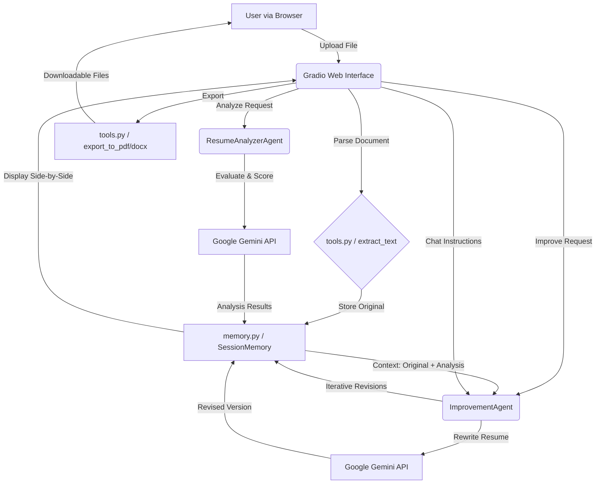

# AI Resume Reviewer & Improver

## Overview
This project is an advanced AI-powered multi-agent application that evaluates, scores, and rewrites resumes to meet professional industry standards. It uses Google's Gemini models to iteratively improve a candidate's resume, providing a rich Side-by-Side comparison UI, live feedback scoring, and an interactive chat interface to refine targeted resume sections.

## System Architecture



## Setup & Installation

1. Clone this repository.
2. Ensure you have Python 3.9+ installed.
3. Install dependencies:
   ```bash
   pip install -r requirements.txt
   ```
4. Set your Gemini API key as an environment variable:
   - On Windows: `set GEMINI_API_KEY=your_key_here`
   - On Mac/Linux: `export GEMINI_API_KEY=your_key_here`

## Hugging Face Spaces Deployment

This application is built with Gradio and is best deployed on **Hugging Face Spaces**.

1. Create a new Space on Hugging Face (Select `Gradio` as the SDK).
2. Upload the contents of this repository to your Space.
3. In your Space's Settings, go to **Variables and secrets**.
4. Add a new secret:
   - **Name:** `GEMINI_API_KEY`
   - **Value:** Your actual Gemini API key.
5. The Space will automatically build and run `app.py`.

## Usage Guide
Run the main web application locally:
```bash
python app.py
```
Open the provided local Gradio URL (typically `http://127.0.0.1:7860`).

1. **Upload**: Select a PDF, DOCX, or TXT format resume in the upload panel.
2. **Analyze**: Click the "**Analyze & Improve**" button. The Analyzer Agent will score your resume and pinpoint weaknesses, while the Improver Agent instantly constructs a rewritten, professionally formatted draft on the right panel.
3. **Iterate**: Use the Chatbot at the bottom of the interface to specify targeted refinements (e.g., "Quantify my bullets in the first role" or "Change the tone to be more executive"). The Improve Agent will surgically implement your instructions.
4. **Export**: Click the download button to grab final output versions formatted as `.pdf` and `.docx`.

## Sample Output Demonstration
**Input**:
> software developer. i made lots web apps using react and nodejs. supervised 2 junior developers.

**Analyzer Output (JSON)**:
```json
{
  "score": 45,
  "strengths": ["Mentions specific tech like React and Node.js", "Mentions supervision"],
  "weaknesses": ["Passive tone", "Lack of metrics/impact", "Poor capitalization and formatting"],
  "missing_keywords": ["Full-Stack", "Mentorship", "Scalability", "Agile"],
  "formatting_issues": ["No bullet points utilized", "Sentence fragments"]
}
```

**Improver Revision**:
> - **Full-Stack Software Engineer**
>   - Architected and deployed scalable web applications leveraging React and Node.js frameworks to drive user engagement.
>   - Mentored and supervised a team of 2 junior developers, leading code reviews and sprint planning to increase team velocity and code quality.
